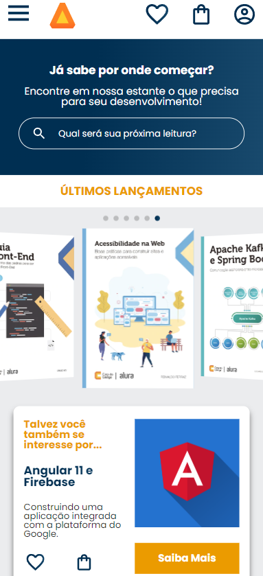
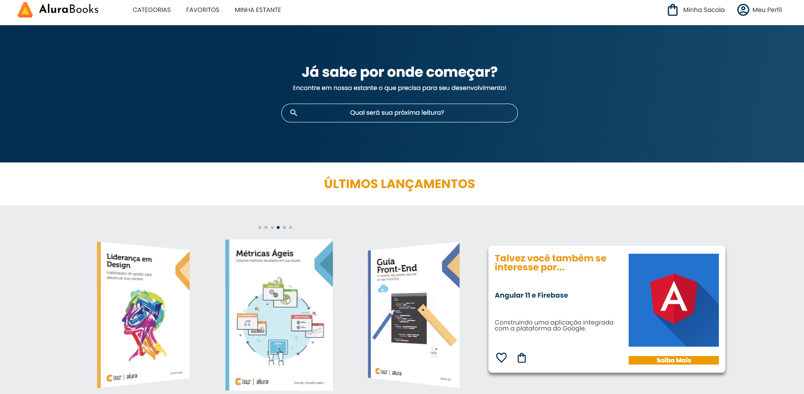

<h1>Alura Books | Livraria Digital</h1>
 

    
    

 
<a href="https://livrariaalurabooks.vercel.app/" target="_blank">Link to page</a>
 
 

This is a project for a digital bookstore in which I used the mobile first methodology, with 3 breakpoints: Mobile (428px), Tablet (1024px) and Desktop (1728px). I included a carousel animation using SwiperJS, animating it with loop and coverFlowEffect.

